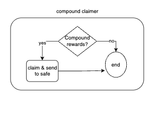

# Compound claimer

This task runs periodically. We decided to create this task that gets the `Compund` token reward claims it and send then to the safe, and ignore the  `Compound` token reward in all the other tasks. Then the other tasks (either settle deposit or settle investment) will invest those usdc.

We decided to do it like this for simplicity, and bcause the amunt that it's not going to be taken in count in the other tasks, will be despicable.

Base addres of compound rewards token [https://basescan.org/address/0x123964802e6ABabBE1Bc9547D72Ef1B69B00A6b1#writeContract]()

